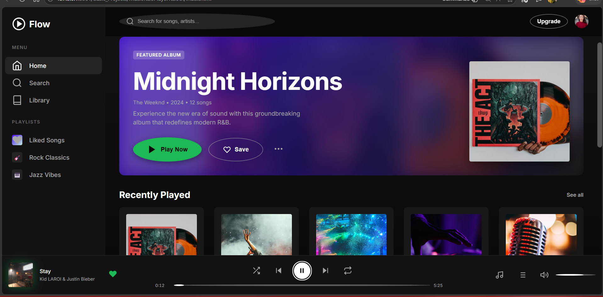

# Flow Music Player 

A modern, professional web-based music player built with HTML5, CSS3, and vanilla JavaScript. Features real audio streaming, responsive design, and a sleek dark-mode interface inspired by Spotify and Apple Music.



##  Features

- **Real Audio Playback** - Stream actual MP3 files with full playback controls
- **Modern UI/UX** - Glassmorphism design with smooth animations and transitions
- **Responsive Layout** - Works seamlessly on desktop, tablet, and mobile devices
- **Keyboard Shortcuts** - Control playback without touching your mouse
- **Playlist Management** - Queue, shuffle, repeat, and skip tracks
- **Progress Tracking** - Real-time progress bar with seeking functionality
- **Volume Control** - Adjustable volume with mute toggle
- **Dark Theme** - Eye-friendly dark mode with professional color palette

##  Quick Start

### Prerequisites
- Modern web browser (Chrome, Firefox, Safari, Edge)
- Local web server (recommended for audio playback) OR
- Internet connection (for demo audio files)

### Installation

1. **Clone or download the repository**
   ```bash
   git clone https://github.com/Muhammadismail-gif/My-Js-Projects
   cd flow-music-player