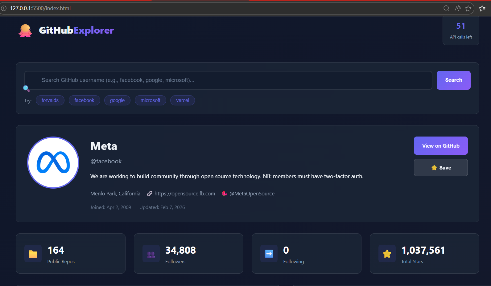

# 🐙 GitHub Explorer

A modern, feature-rich web application for searching and analyzing GitHub user profiles with real-time data visualization and interactive analytics.



## 🚀 Live Demo

[View Live Demo](./GitHub Profile Search/index.html)

---

## ✨ Features

### 🔍 Search & Discovery
- **Instant Profile Search** - Search any GitHub username with real-time suggestions
- **Quick Access Chips** - One-click search for popular profiles (Facebook, Google, Microsoft, etc.)
- **Smart Autocomplete** - Recent searches and saved profiles for quick access

### 📊 Data Visualization
- **Language Distribution Chart** - Doughnut chart showing repository language breakdown
- **Repository Analytics** - Bar chart displaying stars, forks, watchers, and issues
- **Contribution Heatmap** - Visual representation of user activity
- **Top Languages** - Progress bars with percentage distribution

### 📁 Repository Management
- **Advanced Filtering** - Search repositories by name or description
- **Smart Sorting** - Sort by stars, forks, name, or recently updated
- **Repository Cards** - Detailed view with language, stats, and metadata
- **Load More** - Pagination for users with 100+ repositories

### 💾 User Management
- **Save Profiles** - Bookmark favorite GitHub users to local storage
- **Quick Access** - Instantly view saved profiles with one click
- **Persistent Storage** - Saved users persist across browser sessions

### 🎨 User Experience
- **Dark Theme** - Modern, eye-friendly dark interface
- **Responsive Design** - Works seamlessly on desktop, tablet, and mobile
- **Smooth Animations** - Number counting, transitions, and hover effects
- **Toast Notifications** - Non-intrusive feedback for user actions
- **Rate Limit Display** - Real-time API quota monitoring

---

## 🛠️ Tech Stack

| Category | Technology |
|----------|-----------|
| **Frontend** | HTML5, CSS3, Vanilla JavaScript (ES6+) |
| **Styling** | CSS Grid, Flexbox, CSS Variables, Animations |
| **Data Visualization** | [Chart.js](https://www.chartjs.org/) |
| **API** | [GitHub REST API v3](https://docs.github.com/en/rest) |
| **Storage** | LocalStorage API |
| **Icons** | Emoji + SVG |

---

## 📦 Installation

### Option 1: Direct Download
```bash
# Download the project
git clone https://github.com/Muhammadismail-gif/My-Js-Projects.git

# Navigate to project folder
cd "My-Js-Projects/GitHub Profile Search"

# Open in browser (or use Live Server)
open index.html